# SO(d) Solver Benchmarks

## Table of Contents
- [Ackley Function](#ackley-function)
    - [Dimension 3](#ackley---dimension-3)
    - [Dimension 5](#ackley---dimension-5)
    - [Dimension 10](#ackley---dimension-10)
    - [Dimension 20](#ackley---dimension-20)
    - [Dimension 50](#ackley---dimension-50)
- [Schwefel Function](#schwefel-function)
    - [Dimension 3](#schwefel---dimension-3)
    - [Dimension 5](#schwefel---dimension-5)

---

## Ackley Function

$$ f(X) = -a \exp\left(-b \sqrt{\frac{1}{n} \sum (X - I)^2}\right) - \exp\left(\frac{1}{n} \sum \cos(c (X - I))\right) + a + \exp(1) $$

Where $a=20$, $b=0.2$, $c=2\pi$, and $n=d^2$.

### Ackley - Dimension 3

| Type: Aggressive | Type: ExtraSafe |
| --- | --- |
| 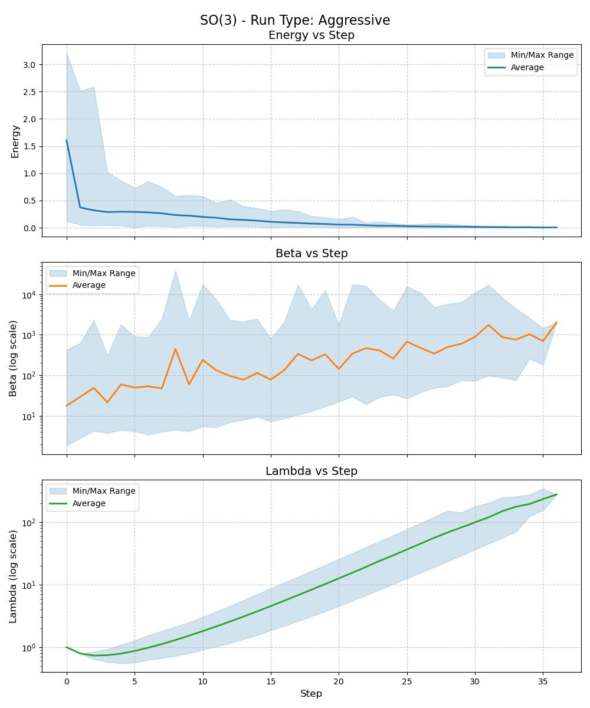 | 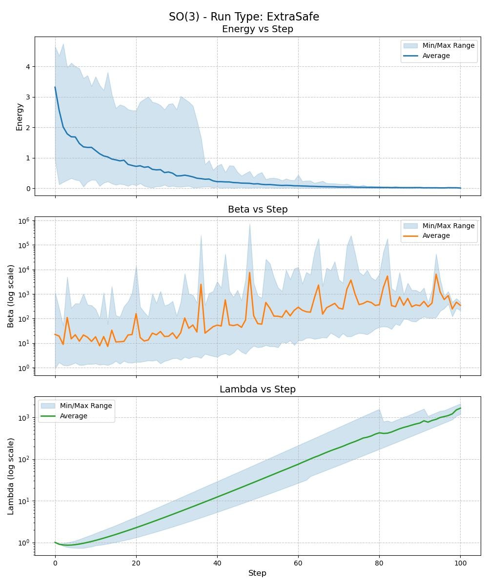 |
| **Runs:** 100 **Success:** 100.0% **Mean Steps:** 29.8 **Median Steps:** 30.0 | **Runs:** 100 **Success:** 100.0% **Mean Steps:** 79.0 **Median Steps:** 80.0 |

---

### Ackley - Dimension 5

| Type: Aggressive | Type: ExtraSafe |
| --- | --- |
| 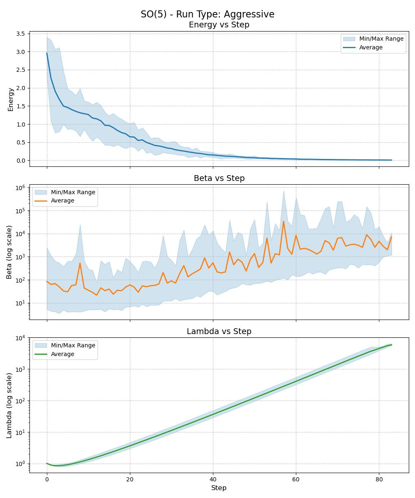 | 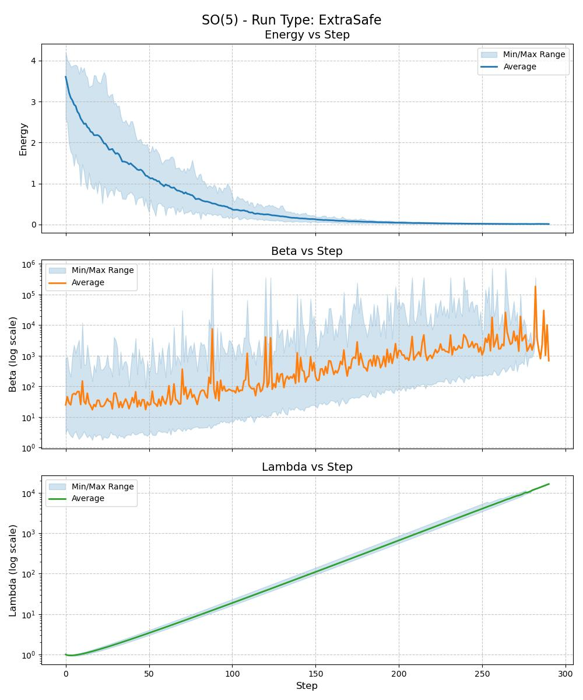 |
| **Runs:** 50 **Success:** 100.0% **Mean Steps:** 78.5 **Median Steps:** 79.0 | **Runs:** 100 **Success:** 97.0% **Mean Steps:** 259.2 **Median Steps:** 260.0 |

---

### Ackley - Dimension 10

| Type: Aggressive | Type: ExtraSafe |
| --- | --- |
| 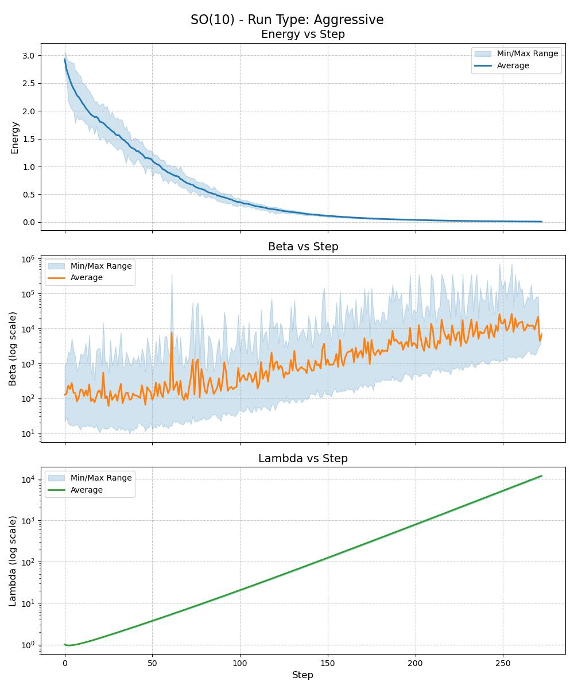 | 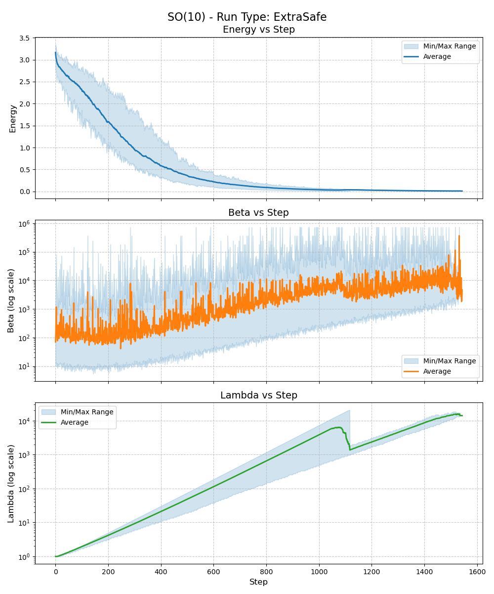 |
| **Runs:** 50 **Success:** 98.0% **Mean Steps:** 267.9 **Median Steps:** 268.0 | **Runs:** 100 **Success:** 95.0% **Mean Steps:** 1286.2 **Median Steps:** 1421.0 |

---

### Ackley - Dimension 20

| Type: Aggressive | Type: ExtraSafe |
| --- | --- |
| 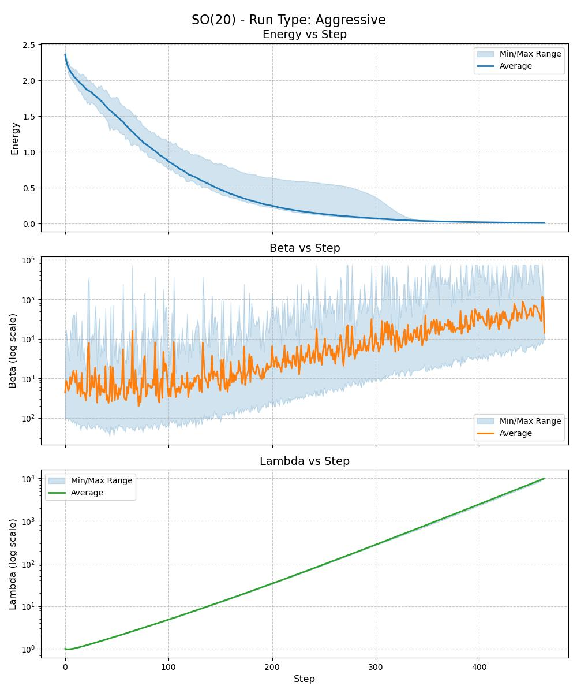 | 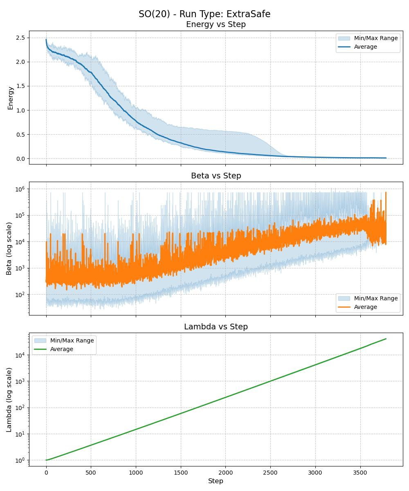 |
| **Runs:** 50 **Success:** 96.0% **Mean Steps:** 458.8 **Median Steps:** 458.0 | **Runs:** 50 **Success:** 76.0% **Mean Steps:** 3558.7 **Median Steps:** 3546.5 |

---

### Ackley - Dimension 50

| Type: ExtraSafe |
| --- |
| 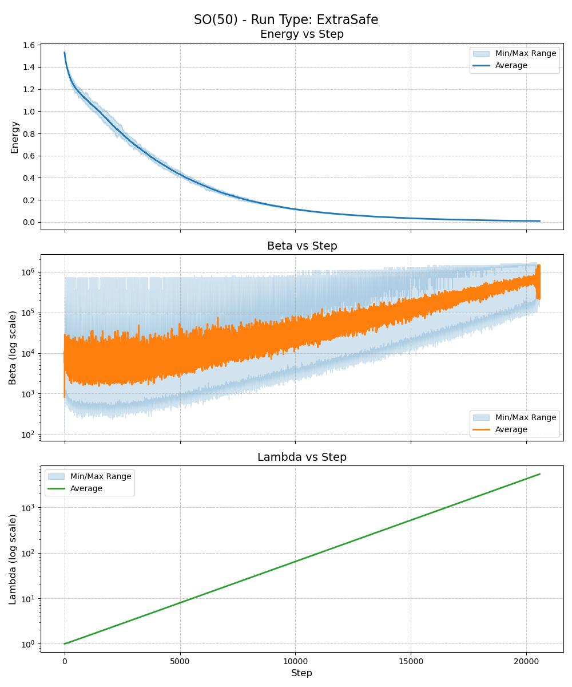 |
| **Runs:** 50 **Success:** 96.0% **Mean Steps:** 20380.8 **Median Steps:** 20384.5 |

---

## Schwefel Function

$$ f(X) = 418.9829n - \sum Z \sin(\sqrt{|Z|}) $$

Where $Z = 250(X - I) + 420.968746$, and $n=d^2$.

### Schwefel - Dimension 3

| Type: Custom |
| --- |
| 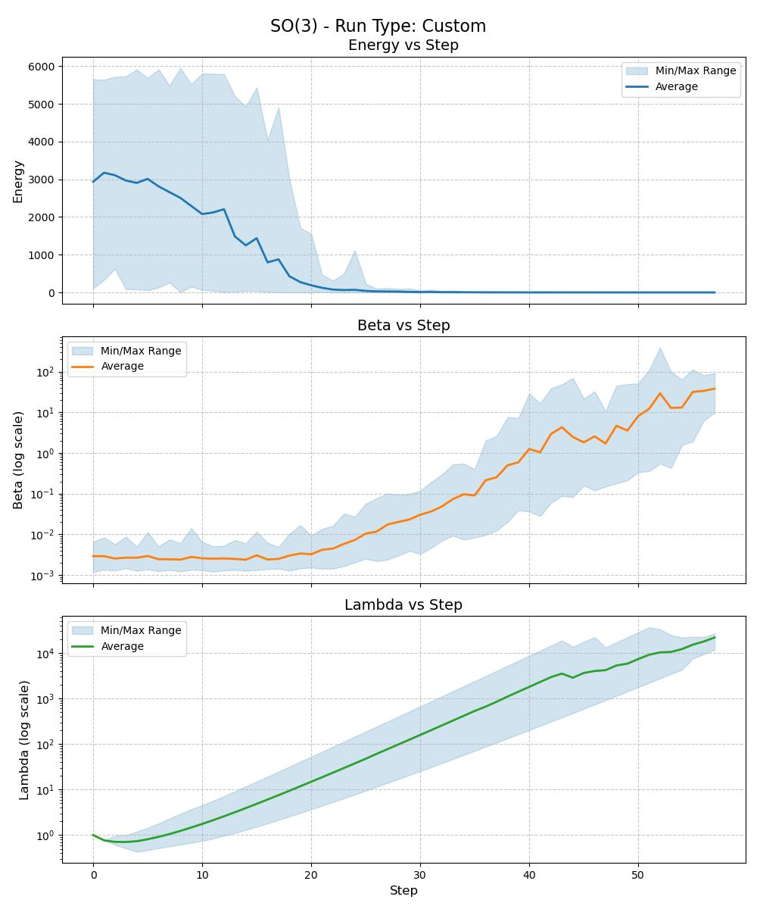 |
| **Runs:** 50 **Success:** 92.0% **Mean Steps:** 50.0 **Median Steps:** 52.0 |

---

### Schwefel - Dimension 5

| Type: Custom |
| --- |
| 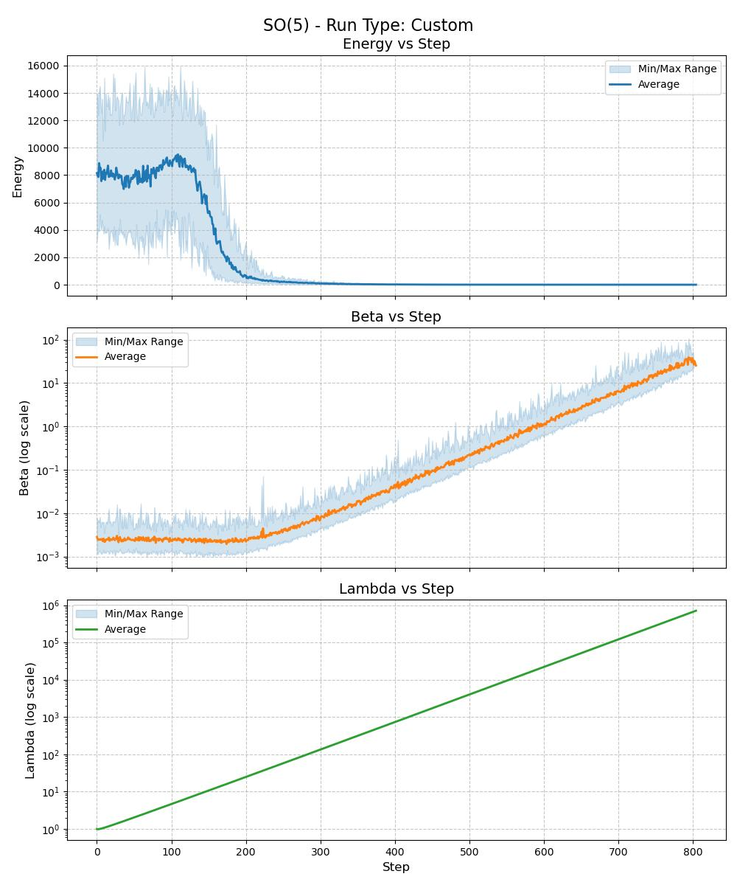 |
| **Runs:** 50 **Success:** 90.0% **Mean Steps:** 776.8 **Median Steps:** 778.0 |

---

